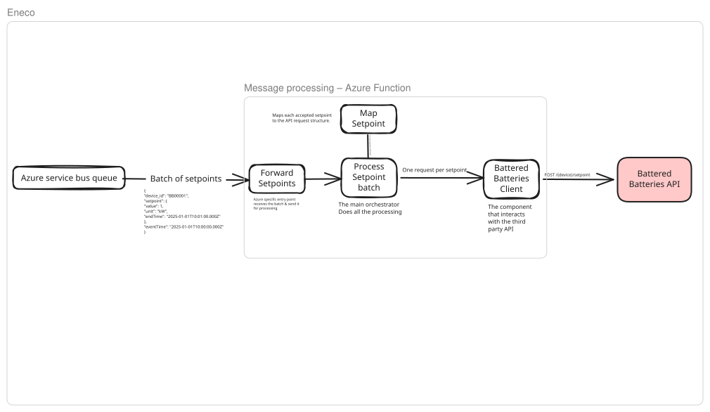

# Eneco Battered Batteries Function

An Azure Function that consumes batches of battery setpoints from Service Bus
and forwards accepted setpoints to the Battered Batteries API.

## Setup

```sh
nvm use
npm install
cp local.settings.json.example local.settings.json
```

Fill in the Service Bus connection string and API key in `local.settings.json`.
Local execution requires Azure Functions Core Tools v4 and either Azurite or a
Storage connection string.

```sh
npm run build
npm run typecheck
npm test
npm audit
npm start
```

## My comments


These are the assumptions I made and the trade-offs behind the implementation.

### Power conversion

I multiply kilowatts by `-1000` to convert to watts and reverse the grid
perspective: positive incoming values discharge the battery, and negative
values charge it. The unit must be exactly `kW`.

The API requires integer watts. I allow `0.000001 W` of rounding tolerance for
floating-point errors and reject larger fractional-watt differences or values
outside the safe integer range.

### Unsupported devices

I interpret “abandon” as discarding unsupported devices without forwarding
them. Their messages are logged and completed. Literal Service Bus abandonment
would cause redelivery even though the device remains unsupported. This is an
assumption rather than literal use of the broker's abandon operation.

### Time and duration

I interpret “active from the moment of arrival” as starting as soon as
practically possible when forwarding. Swagger requires a future start, so each
HTTP attempt uses:

```text
durationMs = incoming endTime - incoming eventTime
durationSeconds = ceil(durationMs / 1000)
startTime = ceil(current HTTP attempt time in milliseconds / 1000) + 1
endTime = startTime + durationSeconds
```

Durations must be between one minute and one hour. Whole-second durations are
preserved exactly; fractional seconds are rounded up, so `60.001` seconds becomes
`61` seconds. Timestamps are recalculated before every attempt so retries do not
reuse a start time that has already passed.

The one-to-two-second future margin is a compromise. Queueing, earlier messages,
network delays, or clock differences can still delay activation or make the
start time stale before the API validates it.

I preserve duration rather than the original absolute end time. A 12:00–12:30
command processed at 12:05 runs approximately 12:05–12:35. That may be undesirable
if discounted electricity is only available until 12:30. Preserving the
original end time would shorten the command instead. This needs an agreed
business rule.

Timestamp parsing currently uses `Date.parse()`, which accepts some non-ISO
strings and normalizes some invalid calendar dates. Strict timestamp validation
is not implemented.

### Late commands and ordering

There is no expiry, maximum-age, or supersession check. A command received after
its original end time still gets a fresh duration. I assume commands normally
arrive promptly, but redelivery can break that assumption.

Messages are processed sequentially within each batch. This preserves local
attempt order, but does not guarantee ordering across redelivery or scaled-out
instances. An older command may fail, a newer command may succeed, and the older
command may then be redelivered and overwrite it. This can happen even with
commands from the same batch.

Before operational use, I would agree whether to discard expired commands,
allow a lateness limit, preserve the original end time, or reject commands older
than the latest accepted instruction for a device.

### Retries and failures

Network failures, timeouts, HTTP 408, 429, and 5xx responses are retryable. By
default, each message gets one initial attempt and one retry, with a five-second
timeout per attempt. Backoff includes jitter and is capped at two seconds.

For HTTP 429, `Retry-After` is honoured locally up to two seconds. Longer delays
stop local retries and lead to abandonment. Service Bus can immediately
redeliver the message, so this does not enforce the requested cooldown. Other
messages and instances can also continue calling the API. There is no global
rate limit, and rapid redelivery can exhaust the broker's delivery limit during
an outage.

If retries are exhausted, only the affected message is abandoned and the batch
continues. Permanent failures, such as HTTP 400 and 404, are logged and completed.
HTTP 204 is the expected success; other successful statuses are treated as
permanent contract failures.

HTTP 401/403 and unexpected non-Axios client failures stop the batch without
settling the affected or later messages. They are not retried locally, though
broker delivery limits still apply. Axios errors without a response are treated
as retryable, which can include some configuration errors.

I log only selected API error fields because full Axios errors can expose the
API key. Authentication and unexpected client failures use a generic safe
message, at the cost of some diagnostic detail.

### Batching and settlement

I chose batches of up to five messages, processed sequentially, to limit API
concurrency within an invocation and reduce waiting time for later messages.
Five is a starting point, not a measured optimum, and does not limit concurrency
across instances.

With the defaults, a batch can spend roughly 50 seconds on HTTP attempts and up
to 10 seconds on retry delays, plus settlement and other overhead. Configure the
queue lock duration comfortably above that budget; two minutes is a starting
point. Batch locks are not automatically renewed through the single-message
renewal setting, and this implementation does not renew them explicitly.

Each message is settled independently, so a later API failure does not itself
replay earlier completed messages. Settlement failures are logged separately.
I do not attempt the opposite settlement when the outcome is uncertain. Other
messages continue, then the invocation fails if processing reaches the end with
settlement failures.

Delivery remains at least once. A timeout can leave the API outcome uncertain,
and a crash after API acceptance but before message completion can cause a
duplicate. Retried commands also receive new timestamps. The implementation is
not idempotent and does not provide exactly-once execution.

### Cancellation

I understood the one-second command as an explanation of how the API clears an
old setpoint. Since the assignment does not define an incoming cancellation
message, I kept the stated one-minute-to-one-hour durations and let each POST
replace the previous setpoint. I would clarify how cancellation should arrive
before adding a separate flow for it.

### Testing

I included one Vitest test, as requested, and listed the other cases as TODO
comments. I chose to test conversion, direction, time rebasing, and message
completion together. I injected the client and clock so I could check these
without calling the supplied API. This does not verify the Azure binding or
HTTP transport; I would check those separately against a mock API. The
type-check command currently covers source files only.

### Further improvements

Given more time, I would first discuss what should happen when an old command
comes back after a newer one has already succeeded. Should I discard it because
its original end time has passed, or because a newer instruction exists for
that device? I kept the current behaviour explicit because the assignment does
not settle that question.

I would also discuss giving each command a stable ID that stays the same across
retries and redelivery. If the API supported an idempotency key, that could help
it recognize a command it had already accepted. The Swagger does not provide
that option, and I would need to agree how it should behave when a retry has
different timestamps. Keeping my own record of processed commands could help,
but would still leave a gap if the API accepted a request and the function
stopped before recording success.

For ordering, I would explore Service Bus sessions per device or storing the
latest instruction for each device. Sessions could help process commands in
order, while a stored latest instruction could help identify an obsolete
redelivery. I would choose between these after agreeing which commands should
still be allowed to run; neither solves every duplicate or timing problem.

Finally, I would revisit how I handle a longer `Retry-After`. Stopping the local
retry is not enough if Service Bus immediately delivers the message again. I
would look at delayed redelivery or a shared cooldown so the requested pause
still applies on the next invocation, while also checking whether the command
is still relevant by then.
